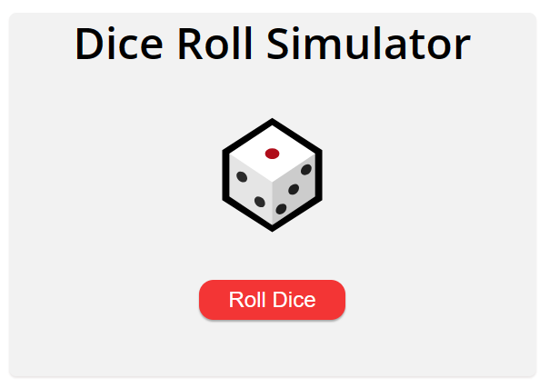

# Dice-Roll-Simulator

## Description
 A simple Javascript program that simulates rolling a dice and displaying the result by clicking the button which triggers an animation and generates a random number and this number is added to a history list.
 To achieve this, we used CSS to style the dice and added a JavaScript event listener to the button. The listener generates a random number, saves it to an array, and updates the history list.

##

